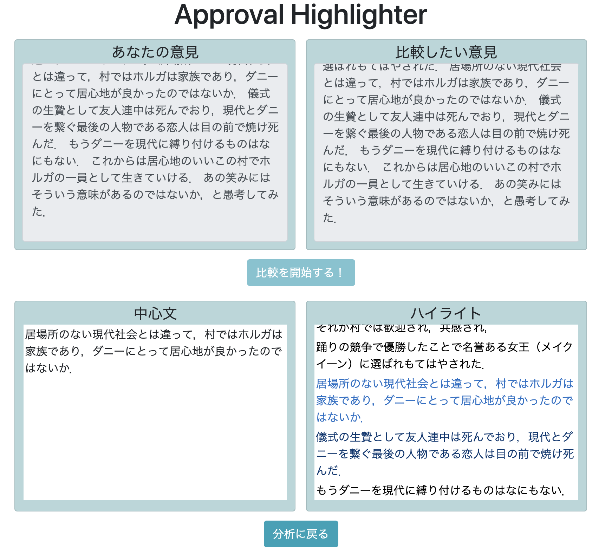

あなたの意見と誰かの意見を比較する補助ツールです．あなたの意見から主張の中心となる箇所を抜き出し，比較したい意見中の中から特に中心文に似ている文をハイライトします．

※内部実装はひとまず極単純なものにしています．時間のある時にチマチマとよくしていこうと思っています．

### 使い方
```bash
docker-compose build
docker-compose frontend yarn install
docker-compose up
```

ブラウザで `localhost:8000` にアクセス

### これを作ろうと思った経緯
[きっかけとなったツイート](https://twitter.com/saya_hakuren/status/1267119192521637892)

口論の多くが，本来は互いに共存できる主張同士だったりしますよね．ある日AIで互いの意見の共通点や相違点をわかりやすくしてあげたら，無用な争いが減って，より建設的な議論ができて，世界がちょっとよくなったりするのかなって妄想したんですよ．

ちょうどWebアプリ開発の勉強にもなるし，久々に Python を描きたい気持ちにもなっていたし，暇を持て余していたしということで，このアプリを作るに至ったわけです．

とりあえず動く形になったので公開することにしました．まだまだ使い物にはならない性能なので，ちょっとずつアルゴリズムとかを改良していこうかなぁと思っている次第です．

### 内部実装
#### backend
言語: Python3
モデル: [Transformers](https://huggingface.co/transformers/) の BERT の日本語訓練済みモデル
API用フレームワーク: Flask

##### 中心文抽出
入力文章（あなたの意見）から，主張の中心となる文を1つ抽出する.

1. 入力文章を文で区切って，各文を BERT に通して文エンベッディングを取得
2. 入力文章全体を BERT に通して，文章エンベッディングを取得
3. 1 と 2 の COS 類似度が最大の文を中心文とする

##### ハイライト
入力文章（比較したい意見）の各文に対し，上で得られた中心文との賛同度合い，反対度合いをスコアリングする．ひとまず類似度ベースで実装．

1. 各文のエンベッディングを取得
2. 中心文のエンベッディングとの COS 類似度をスコアとする

#### frontend
フレームワーク: Nuxt, Vue, BootstrapVue, typescript

BootstrapVue すごい．何もしてないのに勝手にいい感じになる．

### 所感
ナイーブな実装にもかかわらず，中心文抽出は案外上手くできているように感じられる．ハイライト機能は全く上手く行っていなくて，特に反対意見が全く出てこない．同じトピックについて言及している文は似ているとされるので，類似度ベースでは土台むりなのだろうなぁという感じ．
技術で解決するか，画面側で解決するかは迷いどころ．ひとまず技術面を模索しよう．

長文を入力すると403エラーが出るのは直さなきゃいけない．あと，類似する文が一個もない時に何もハイライトされていなくて不安になるので，ハイライトの表示はもう少し考えるべきかも．最低でも1個はハイライトされるとかかなぁ？
